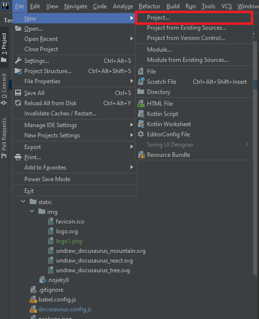

In this article, We are going to explore basics of the Tesbo and Will start to write the one simple test script.

We need some Prerequisite, let’s take a look on it

1. Java : Tesbo is complete written into the Java
2. Maven : We will use the maven to manage the Tesbo dependency and configure the test run using maven, this will helpful when you need to configure test execution with CI/CD server like Jenkins
3. Any IDE or Editor
4. Basic Git Knowledge

Now Let's open the Editor and create a Test in Tesbo, We are here using an Intellij Community Edition but you can use it any Java Editor App. 

1. Create a New Project.



<br/>

2. Select Maven >> Create From Archetype >>  org.apache.maven.archetype:meven-archetype-quickstart

We will create Maven Project for the dependency management and Running Test. This will be most useful while configuring with the CI/CD. 


3. Enter the Required Details and Finish
Maven will download all the required configuration


4. Once Finish, Folder structure will look like this.


`We required a different folder structure for the createing a test in Tesbo but we will talk about it later`

5. Now, Let's download the Tesbo from Maven Repo.

- Copy following code into the POM.xml

```
<!-- https://mvnrepository.com/artifact/io.tesbo/Tesbo-Web -->
<dependency>
    <groupId>io.tesbo</groupId>
    <artifactId>Tesbo-Web</artifactId>
    <version>0.0.6</version>
</dependency>
```

Find the Latest Version from [here](https://mvnrepository.com/artifact/io.tesbo/Tesbo-Web/)

6. Once you done with it, Intellij will automatically detect the changes and download the dependency but if not works for you then you can run the `mvn intall` to download dependency.


#### Now we have environment ready for the creating a test. Let's create a Folder Structure shown as below inside the `Test`

```
└── src                                   
     ├── test 
           ├── java                                # Contains all the tests folder
           │        ├── runner
           │        │      └─── Runner.java        # Main Test Runner Invocation file  
           │        ├── locator       
           │        │      └─── moduelName.json    # Locators will be define here
           │        └── tests
           │        │       └─── moduleName.tests  # All the test define here
           │        └── suite
           │        │       └─── moduleName.suite  # Collection of Test for execution
           │        └── customStep
           │               └─── anyfilename.java   # Define your custom code here
           │        └── dataset                    # defing data in json or Excel 
           │
           └── config.json           # Main configuration file for the Running Tesbo
```

1. We are heading towards the creating a first scripts. Let's create a file with a name `GoogleSearch.tests`.

- Copy Following test scripts into it

```
Test: Search on Google
#Search #Google #demo
Step: Enter 'Cheeze' @SearchBox
Step: Press Enter
Step: pause until @firstResult is displayed
Verify: @firstResult is displayed
Step: Print text @firstResult
End
```

In Tesbo, 
- Tests are declared by the `Test:` Keyword following with the Test Title or description like `Search on Google` 
- `Step:` is used for the defining the action that need to perform on the Web Pages like Click, Enter Text, Scroll Page etc.
- `Verify:` is used for the asserting elements on the page. Test is fail when assert conditions are fail.
- `End` is used for declaring at the end of the Test. 
- `@` is used for the defining the locators value e.g. @SearchBox, @firstResult
-  `#` is used for adding tags to the Test. Tags are use full features when you run the Test. e.g. #Google


2. Once we have the Test Ready, We required to define element locators for the `SearchBox` and `firstResult`. 

In Tesbo, We are declaring locators into the json format. Create a `Google.json` inside the locator directory.

```
{
"SearchBox" : "q",
"firstResult" : "(//div[@id=\"search\"]//h3)[1]"
}
```  

- Here you are observed that you don't need to declare the locators types, As Tesbo is automatically identify that. So this is again another advantages of the Tesbo. 

3. Now We have the test ready, We will go for the creating a `config.json` which will help us to run the Test. 

```
{
"run": {
    "baseUrl": "https://www.phptravels.net/admin",
    "by": {
      "tag": ["variable"]
    },
    "browser": {
      "name": ["chrome"]
    }    
  }
}
```

- `config.json` is the configuration file for the running the test.
- `run` contains all the details about which test is going to run and in which browser going to run.


4. Okey, We are ready now for Running Test, We have Test file, Locators file and Config file, Just need to create Java Runner file. 

- Create a `Runner.java`Java class inside the Runner directory

```
package runner;
   
   import execution.Tesbo;
   
   public class Runner {
       public static void main(String[] args) {
   
           Tesbo tesbo = new Tesbo();
           tesbo.run(args);
       }
   }
```

- and Run this java class, and here you go... Your Test is running...

5. Once Test completed you will be get the result inside the `htmlReport >> currentBuildReport.json`.


you will get the basic idea about the creating and running Test into the Tesbo, You can explore the more features of Tesbo from Here and following is the some of the Quick Links

- Understanding the Steps Keyword
- Config file 

:::note
We have made a setup very easy for you by creating a GitHub repository with the same setup, you can clone or download it from [here](https://github.com/Tesbo/Tesbo-Skelaton)
:::


 


                                                                                      


